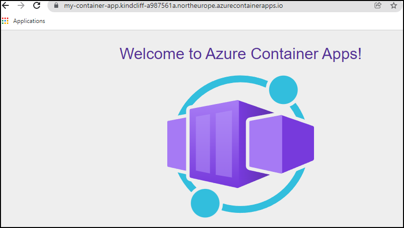
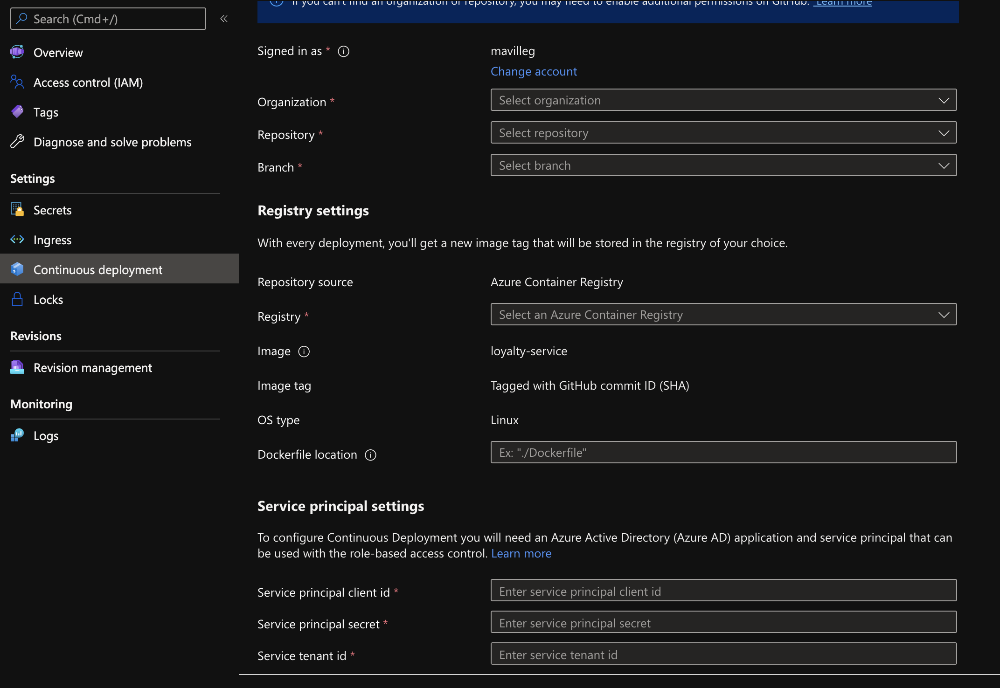
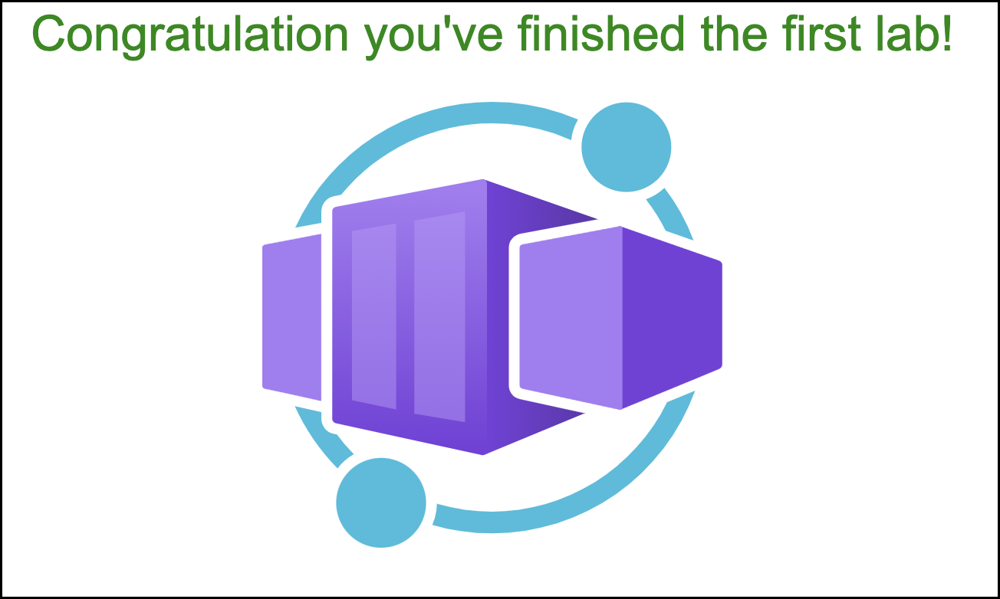

# Deploy a container app using Az

This first lab will guide you to deploy your first *Hello World* app on Containers apps, an application accessible from the Internet.

## Create an environment

Before deploying your containerized application, you need a "place" to host your application. In Azure Container Apps, the underlying infrastructure is called an `environment`. An environment creates a secure boundary around a group of container apps. Container Apps deployed in the same environment are deployed in the same virtual network and write logs to the same *Log Analytics* workspace.

**Azure Log Analytics** is used to monitor your container app and is required when creating an Azure Container Apps environment.

Let's start by setting some variables:

``` bash
RESOURCE_GROUP="rg-my-container-apps"
LOCATION="northeurope"
LOG_ANALYTICS_WORKSPACE="my-container-apps-logs"
CONTAINERAPPS_ENVIRONMENT="my-environment"
```

- **RESOURCE_GROUP**: the Azure resource group which will contain your container apps environment
- **LOCATION**: the Azure region in which will be deployed your apps. Be careful, Azure Container Apps is not supported in all regions yet.
- **LOG_ANALYTICS_WORKSPACE**: the name of the logs analytics workspace
- **CONTAINERAPPS_ENVIRONMENT**: the name of the **container apps** environment.

With these variables defined, you can create a resource group to organize the services related to your new container app.

<details> <summary>Spoiler</summary>

```bash
az group create --name $RESOURCE_GROUP --location "$LOCATION"
```

</details>

Create a new *Log Analytics workspace* with the following command:

<details> 

<summary>Spoiler</summary>

```bash
az monitor log-analytics workspace create --resource-group $RESOURCE_GROUP --workspace-name $LOG_ANALYTICS_WORKSPACE
```

</details>

Next, retrieve the Log Analytics Client ID and client secret and put them in variables (LOG_ANALYTICS_WORKSPACE_CLIENT_ID and LOG_ANALYTICS_WORKSPACE_CLIENT_SECRET)

<details> <summary>Spoiler</summary>

#### Bash

Make sure to run each query separately to give enough time for the request to complete.

```bash
LOG_ANALYTICS_WORKSPACE_CLIENT_ID=`az monitor log-analytics workspace show --query customerId -g $RESOURCE_GROUP -n $LOG_ANALYTICS_WORKSPACE --out tsv`
```

```bash
LOG_ANALYTICS_WORKSPACE_CLIENT_SECRET=`az monitor log-analytics workspace get-shared-keys --query primarySharedKey -g $RESOURCE_GROUP -n $LOG_ANALYTICS_WORKSPACE --out tsv`
```

#### PowerShell

Make sure to run each query separately to give enough time for the request to complete.

```powershell
$LOG_ANALYTICS_WORKSPACE_CLIENT_ID=(az monitor log-analytics workspace show --query customerId -g $RESOURCE_GROUP -n $LOG_ANALYTICS_WORKSPACE --out tsv)
```

```powershell
$LOG_ANALYTICS_WORKSPACE_CLIENT_SECRET=(az monitor log-analytics workspace get-shared-keys --query primarySharedKey -g $RESOURCE_GROUP -n $LOG_ANALYTICS_WORKSPACE --out tsv)
```

</details>

#### Azure Container Apps environment

Individual container apps are deployed to an Azure Container Apps environment. To create the `environment`, run the following command:

```azurecli
az containerapp env create \
--name $CONTAINERAPPS_ENVIRONMENT \
--resource-group $RESOURCE_GROUP \
--logs-workspace-id $LOG_ANALYTICS_WORKSPACE_CLIENT_ID \
--logs-workspace-key $LOG_ANALYTICS_WORKSPACE_CLIENT_SECRET \
--location "$LOCATION"
```

> You may receive an error message telling that features are not allowed for this subscription. It means that the service Azure Container Apps is not available for the selected region.

Once the environment is created, it is time to deploy the applications.

### Create your first app

Let's create and deploy your first hello-world application with the command `az containerapp create` which is documented [here](https://docs.microsoft.com/fr-fr/cli/azure/container). We will use a ready-to-use container image, the `mcr.microsoft.com/azuredocs/containerapps-helloworld:latest`.

> Use `az containerapp --help` to discover the different available parameters

Don't forget to set the parameter `--ingress` to `external` to make the container app available to public requests (exposed to the Internet). By adding the query parameter, you can format the result returned by the create command: `--query configuration.ingress.fqdn`

<details>
<summary> Spoiler </summary>

``` bash
az containerapp create \
  --name my-container-app \
  --resource-group $RESOURCE_GROUP \
  --environment $CONTAINERAPPS_ENVIRONMENT \
  --image mcr.microsoft.com/azuredocs/containerapps-helloworld:latest \
  --target-port 80 \
  --ingress 'external' \
  --query configuration.ingress.fqdn
```

In our case, the `create` command returns (only) the container app's fully qualified domain name because we specified the `query` parameter.


</details>  


Copy this URL to a web browser to see the following message.



Open the [Azure Portal](https://portal.azure.com). In your resource group, you should see your container apps environment but also your container app. Click on it.
From here, you can directly see, diagnose or reconfigure your application, such as changing the ingress configuration, the secrets, the load balancing, or the continuous deployment:


That's it! How simple is it to deploy and host an application!

# Create a revision
A revision is an immutable snapshot of a container app. The first revision is automatically created when you deploy your container app. New revisions will be automatically created when a container app's template configuration changes. Indeed, while revisions are immutable, they are affected by changes to global configuration values, which apply to all revisions.

Revisions are most useful when you enable ingress to make your container app accessible via HTTP. Revisions are often used when you want to direct traffic from one snapshot of your container app to the next. Typical traffic direction strategies include A/B testing and BlueGreen deployment.

The following diagram shows a container app with two revisions.


> Note that changes made to a container app fall under one of two categories: revision-scope and application-scope changes:
`Revision-scope` changes are any change that triggers a new revision (e.g: changes to containers, add or update scaling rules, changes to Dapr settings, etc.)
`Application-scope` changes don't create revisions (e.g: changes to traffic splitting rules, turning ingress on or off, changes to secret values, etc.)

### Create your first revision

By default your container app is set on "single revision mode". It means that each new revision will ecrase the current revision and take all the incoming traffic. To have several revisions running at the same time you must enable the "multi-revision mode" on your containerapp. 

<details> <summary>Spoiler</summary>

Go to the revision management blade on the left inside of the container apps panel. At the top of the page you'll find the "choose revision mode" option where you'll be able to choose the revision mode. 


</details>

Let's create and deploy a new version of the Hello World application with a different layout. To do so, you will have to deploy a new container within our application, meaning that we're doing a revision-scope change. This new version of our application can be found on docker hub `mavilleg/acarevision-helloworld:acarevision-hellowold`. (yes, there is a typo)

Once this new revision is provisionned, we will configure an even split of the traffic between the two revisions applied by assigning percentage values. You can decide how to balance traffic among different revisions. Traffic splitting rules are assigned by setting weights to different revisions.

<details> <summary>Spoiler</summary>

Go to the revisions management blade on the left inside of the container apps panel.
Click on `Create a new revision`


You can then decide to either edit the existing container image definition or add a new one (but then, don't forget to delete the existing one or your deployment may fail!). Click on `Add` in order to pull the new image that will be used to create the new revision.


  
</details>

Once your new revision is provisioned, you can split the traffic between them using the revision management panel within the Azure portal. Hitting the endpoint will result serving one of the revision depending on the chosen ponderation (in %).

> Note that new revisions may remain active until you deactivate them, or you have to your container app to automatically deactivate old revisions (called `single revision mode`).

- Inactive revisions remain as a snapshot record of your container app in a certain state.
- You are not charged for inactive revisions.
- Up to 100 revisions remain available before being purged.

You can see all revision using the `az containerapp revision list`and have more detail on a specific one using the `az containerapp revision show` command.

<details> <summary>Spoiler</summary>

```bash
az containerapp revision list \
  --name <APPLICATION_NAME> \
  --resource-group <RESOURCE_GROUP_NAME> \
  -o table
```

``` bash
az containerapp revision show \
  --revision <REVISION_NAME> \
  --resource-group <RESOURCE_GROUP_NAME>
```

</details>

Remember with the `revision mode` and set it up on "multi". This way, you can have multiple revisions at the same time, which is commonly used for A/B testing or blue-green scenarios. Or you can use single revision mode to automatically replace the current version by the new one.

# Continuous Deployment

Azure Container Apps allows you to use GitHub Actions to publish revisions to your container app. As commits are pushed to your GitHub repository, a GitHub Action workflow is triggered which updates the container image in the container registry. Once the container is updated in the registry, the workflow creates a new revision within Azure Container Apps based on the updated container image.

The GitHub action is triggered by commits to a specific branch in your repository. When creating the integration link, you can decide which branch triggers the action.


## Setup your Github repository

In order to be able to setup your continuous deployment you'll need a github account and a newly created repository. We made a public repository where you'll find the sources of the [Hello World container](https://github.com/mavilleg/azurecontainerapps-helloworld). [Fork](https://docs.github.com/en/get-started/quickstart/fork-a-repo) and then clone this repository within your own environment.

Now that you have the source code you will be able to modify it and rebuild a container that will be pushed onto Azure Container Apps.

## Attach Github Actions to your container App

Now that you have a Repo to attach to your environment, you'll have to setup the correct rights on Azure to configure the continous deployment. When attaching a GitHub repository to your container apps, you need to provide a service principal context with the contributor role. The parameter that we will need to configure within the container app are the service principal's `tenantId`, `cliendId`, and `clientSecret`.

<details> <summary>Spoiler</summary>

``` bash
az ad sp create-for-rbac \
  --name <SERVICE_PRINCIPAL_NAME> \
  --role "contributor" \
  --scopes /subscriptions/<SUBSCRIPTION_ID>/resourceGroups/<RESOURCE_GROUP_NAME> \
  --sdk-auth
  ```

  The return value from this command is a JSON payload, which includes the service principal's `tenantId`, `cliendId`, and `clientSecret`.

  </details>

Once those values retrieved, you will have to [create an Azure container registry](https://docs.microsoft.com/en-us/azure/container-registry/container-registry-get-started-portal) being able to host the newly created containers.

> This registry must have the *Admin User* enabled, or the integration with ACA won't work.

<details> <summary>Spoiler</summary>

Open your registry and under the `Access keys` panel, click on `Enabled` to enable the user admin. Or use:

``` bash
az acr update -n <acrName> --admin-enabled true
```

</details>

Once configured, you can move forward by attaching your GitHub repo to the revision.



Once everything is in place you can see that a new folder `.github/workflows` has been added to your project. It hosts a YAML file that will allow the triggering of an automatic GitHub Action that will deploy any changes pushed onto the branch. It will also automatically setup some secrets on your application to store the admin's login to reach out to the Container Registry. We will see later in this lab how to manage those secrets.


The `az containerapp github-action show` command returns the GitHub Actions configuration settings for a container app. It returns a JSON payload with the GitHub Actions integration configuration settings.

<details> <summary>Spoiler</summary>

``` bash
az containerapp github-action show \
  --resource-group <RESOURCE_GROUP_NAME> \
  --name <CONTAINER_APP_NAME>
```

</details>

Let's test that out!

## Putting everything together

Open your project within VS Code (or your favorite IDE). You should see that the `.github/workflows` has been added. If it's not the case, synchronize the change that has been made onto the project (git pull request).

Now you can modify the source code of the Hello World container that we are using since the beginning. For example, you could change the text above the logo under the `index.html` file.

Once the change are commited you can go to your GitHub repos to see the GitHub Action occurring:


As you can see, pushing the changes (commit) automatically triggered a GitHub Action workflow that built and deployed our new container into our registry and then on our container apps under a new revision. You can validate it by going under the revision management panel and see your newly provisioned revision.


As you can see the revision is not loadbalanced yet, meaning that none of the traffic is routed to it. Supporting multiple revisions in Azure Container Apps allows you to manage the versioning and amount of traffic sent to each revision.

Once a part (or all) of the traffic is sent to your app, you can test that the newly version of your application is running correctly.



All of this can be configured as needed. Indeed, you can change whether or not your container app supports multiple active revisions. The `activeRevisionsMode` property accepting two values:

- multiple: Configures the container app to allow more than one active revision.
- single: Automatically deactivates all other revisions when a revision is activated.

Enabling single mode makes it so that when you create a revision-scope change and a new revision is created, any other revisions are automatically deactivated.

You could also manage the different aspects of a revision using the [`az containerapp revision`](https://docs.microsoft.com/en-us/azure/container-apps/revisions-manage?tabs=bash#list) command.

## Conclusion
With this first lab you learned the main concepts of Azure container apps and its management.

In azure container apps, individual container apps are deployed to a single Azure Container Apps environment, which acts as a secure boundary around groups of container apps. Container Apps in the same environment are deployed in the same virtual network and write logs to the same Log Analytics workspace.
Azure Container Apps manages the details of Kubernetes and container orchestrations for you. Containers in Azure Container Apps can use any runtime, programming language, or development stack of your choice.
The Azure Container Apps application lifecycle revolves around revisions. A revision being an immutable snapshot of a container app. When you deploy a container app, the first revision is automatically created. More revisions are created as containers change, or any adjustments are made to the configuration.