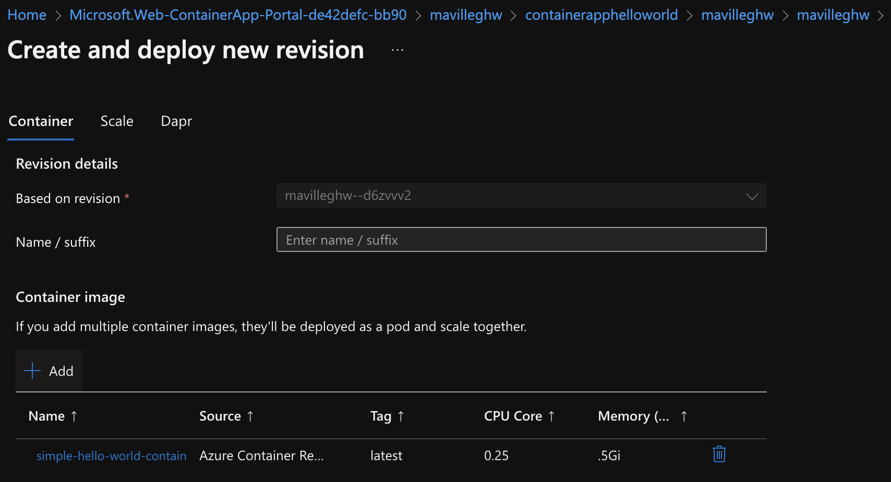
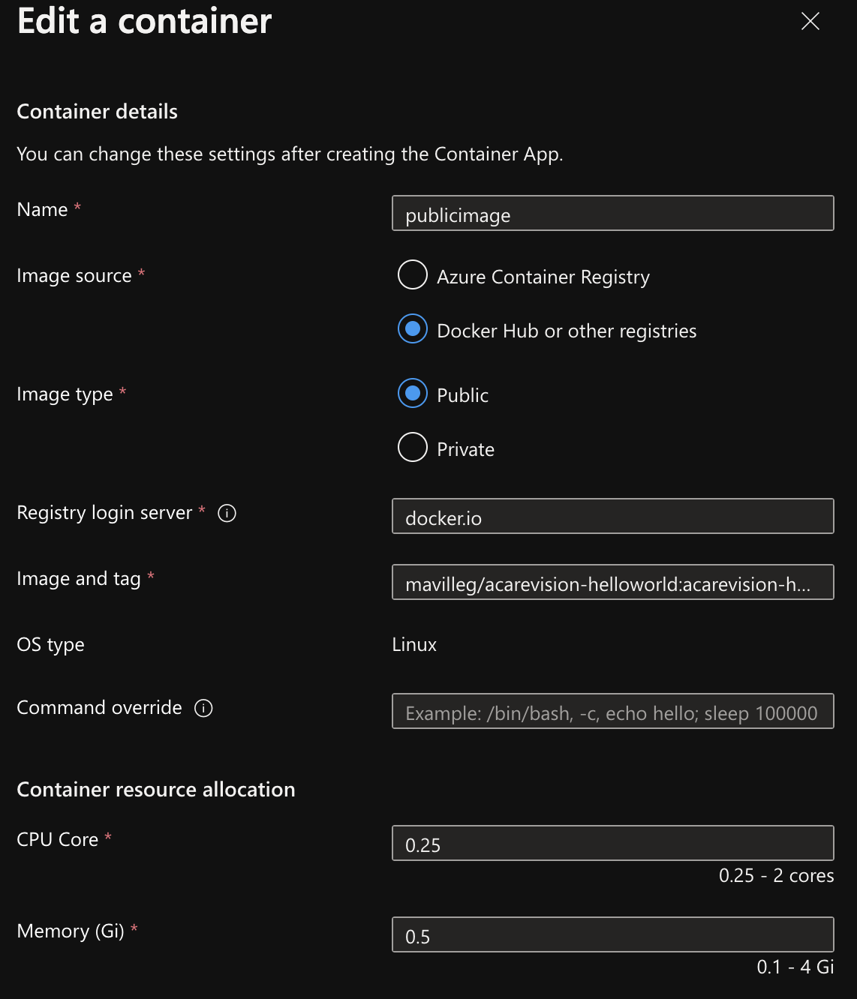

# Deploy a container app using Az

This first lab will guide you to deploy your first *Hello World* app on Containers apps, an application accessible from the Internet.

You may find some documentation about Azure Container Apps below : 
 - [Overview](https://docs.microsoft.com/en-us/azure/container-apps/overview)
 - [Environments](https://docs.microsoft.com/en-us/azure/container-apps/environment)
 - [Containers](https://docs.microsoft.com/en-us/azure/container-apps/containers)
 - [Revisions](https://docs.microsoft.com/en-us/azure/container-apps/revisions)

## Create an environment

Before deploying your containerized application, you need a "place" to host your application. In Azure Container Apps, the underlying infrastructure is called an `environment`. An environment creates a secure boundary around a group of container apps. Container Apps deployed in the same environment are deployed in the same virtual network and write logs to the same *Log Analytics* workspace.

**Azure Log Analytics** is used to monitor your container app and is required when creating an Azure Container Apps environment.

Once the environment is created, it is time to deploy the applications.

### Create your first app

Let's create and deploy your Fabmedical application using the container images you published to the registry

# Create a revision
A revision is an immutable snapshot of a container app. The first revision is automatically created when you deploy your container app. New revisions will be automatically created when a container app's template configuration changes. Indeed, while revisions are immutable, they are affected by changes to global configuration values, which apply to all revisions.

Revisions are most useful when you enable ingress to make your container app accessible via HTTP. Revisions are often used when you want to direct traffic from one snapshot of your container app to the next. Typical traffic direction strategies include A/B testing and BlueGreen deployment.

### Create your first revision

By default your container app is set on "single revision mode". It means that each new revision will ecrase the current revision and take all the incoming traffic. To have several revisions running at the same time you must enable the "multi-revision mode" on your containerapp. 

Let's create and deploy a new version of the application with a different layout. To do so, you will have to deploy a new container within our application, meaning that we're doing a revision-scope change. This new version of our application can be found on docker hub `mavilleg/acarevision-helloworld:acarevision-hellowold`. (yes, there is a typo)

Once this new revision is provisionned, we will configure an even split of the traffic between the two revisions applied by assigning percentage values. You can decide how to balance traffic among different revisions. Traffic splitting rules are assigned by setting weights to different revisions.

<details> <summary>Spoiler</summary>

Go to the revisions management blade on the left inside of the container apps panel.
Click on `Create a new revision`



You can then decide to either edit the existing container image definition or add a new one (but then, don't forget to delete the existing one or your deployment may fail!). Click on `Add` in order to pull the new image that will be used to create the new revision.


  
</details>

Once your new revision is provisioned, you can split the traffic between them using the revision management panel within the Azure portal. Hitting the endpoint will result serving one of the revision depending on the chosen ponderation (in %).

> Note that new revisions may remain active until you deactivate them, or you have to your container app to automatically deactivate old revisions (called `single revision mode`).

- Inactive revisions remain as a snapshot record of your container app in a certain state.
- You are not charged for inactive revisions.
- Up to 100 revisions remain available before being purged.

You can see all revision using the `az containerapp revision list`and have more detail on a specific one using the `az containerapp revision show` command.

<details> <summary>Spoiler</summary>

```bash
az containerapp revision list \
  --name <APPLICATION_NAME> \
  --resource-group <RESOURCE_GROUP_NAME> \
  -o table
```

``` bash
az containerapp revision show \
  --revision <REVISION_NAME> \
  --resource-group <RESOURCE_GROUP_NAME>
```

</details>

Remember with the `revision mode` and set it up on "multi". This way, you can have multiple revisions at the same time, which is commonly used for A/B testing or blue-green scenarios. Or you can use single revision mode to automatically replace the current version by the new one.

# Continuous Deployment

Azure Container Apps allows you to use GitHub Actions to publish revisions to your container app. As commits are pushed to your GitHub repository, a GitHub Action workflow is triggered which updates the container image in the container registry. Once the container is updated in the registry, the workflow creates a new revision within Azure Container Apps based on the updated container image.

The GitHub action is triggered by commits to a specific branch in your repository. When creating the integration link, you can decide which branch triggers the action.


## Setup your Github repository


Now that you have the source code you will be able to modify it and rebuild a container that will be pushed onto Azure Container Apps.

## Attach Github Actions to your container App

Now that you have a Repo to attach to your environment, you'll have to setup the correct rights on Azure to configure the continous deployment.


## Putting everything together

Open your project within VS Code (or your favorite IDE). You should see that the `.github/workflows` has been added. If it's not the case, synchronize the change that has been made onto the project (git pull request).

Now you can modify the source code of the container that we are using since the beginning. For example, you could change the number of speakers or sessions in the API.

Once the change are commited you can go to your GitHub repos to see the GitHub Action occurring:


As you can see, pushing the changes (commit) automatically triggered a GitHub Action workflow that built and deployed our new container into our registry and then on our container apps under a new revision. You can validate it by going under the revision management panel and see your newly provisioned revision.


As you can see the revision is not loadbalanced yet, meaning that none of the traffic is routed to it. Supporting multiple revisions in Azure Container Apps allows you to manage the versioning and amount of traffic sent to each revision.

Once a part (or all) of the traffic is sent to your app, you can test that the newly version of your application is running correctly.

All of this can be configured as needed. Indeed, you can change whether or not your container app supports multiple active revisions. The `activeRevisionsMode` property accepting two values:

- multiple: Configures the container app to allow more than one active revision.
- single: Automatically deactivates all other revisions when a revision is activated.

Enabling single mode makes it so that when you create a revision-scope change and a new revision is created, any other revisions are automatically deactivated.


## Conclusion
With this first lab you learned the main concepts of Azure container apps and container management.

In azure container apps, individual container apps are deployed to a single Azure Container Apps environment, which acts as a secure boundary around groups of container apps. Container Apps in the same environment are deployed in the same virtual network and write logs to the same Log Analytics workspace.
Azure Container Apps manages the details of Kubernetes and container orchestrations for you. Containers in Azure Container Apps can use any runtime, programming language, or development stack of your choice.
The Azure Container Apps application lifecycle revolves around revisions. A revision being an immutable snapshot of a container app. When you deploy a container app, the first revision is automatically created. More revisions are created as containers change, or any adjustments are made to the configuration.
